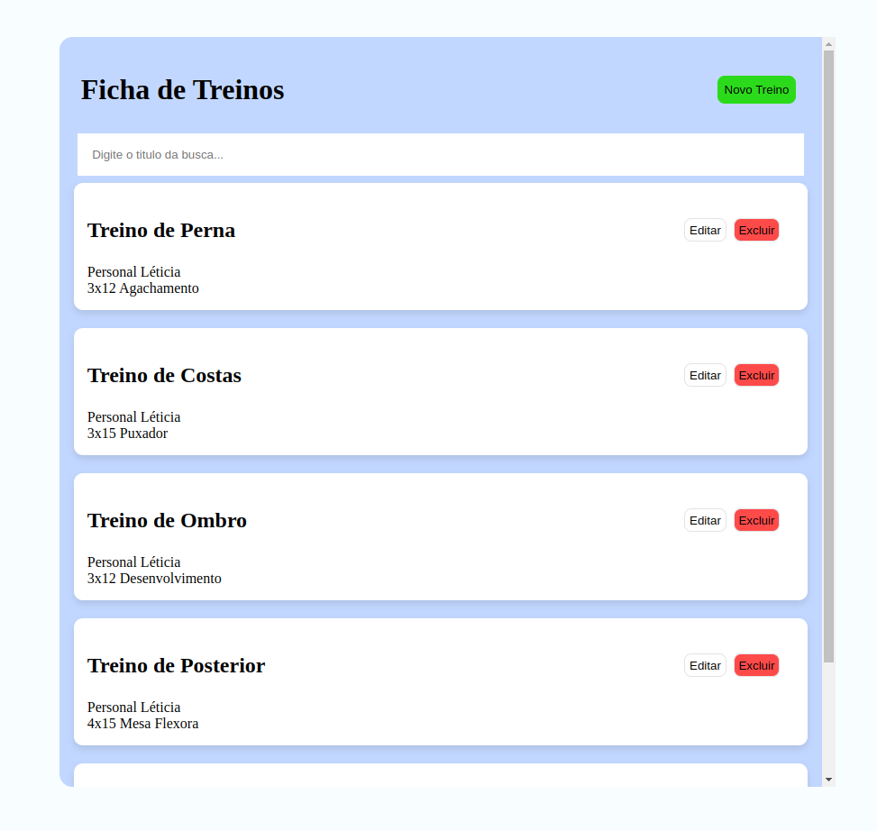

# UI Madelyn


A seguinte interface permite o usuário adicionar treinos na sua ficha de academia. O layout pode ser alterado para qualquer outro tipo de aplicação que envolve operações de adicionar, listar, atualizar e cadastrar. 

## Instalação

Clone este reposotório e instale as dependências.

```bash
git clone https://github.com/gesad-science/madelyn.git

npm install
# or
yarn
# or
pnpm

```

# Execução

```bash
npm run dev
# or
yarn dev
# or
pnpm dev
# or
bun dev
```

Open [http://localhost:3000](http://localhost:3000) with your browser to see the result.

You can start editing the page by modifying `app/page.tsx`. The page auto-updates as you edit the file.

This project uses [`next/font`](https://nextjs.org/docs/basic-features/font-optimization) to automatically optimize and load Inter, a custom Google Font.

## Exemplo 

A interface permite adicionar novos treinos, todos os dados são armazenados no local storage do navegador. As operações de adicionar, listar, atualizar e deletar são realizadas na mesma página.


s

## Tecnologias

- [React](https://reactjs.org/)
- [Next.js](https://nextjs.org/)
- [TypeScript](https://www.typescriptlang.org/)
- [Syntactically Awesome Style Sheets](https://sass-lang.com/)


